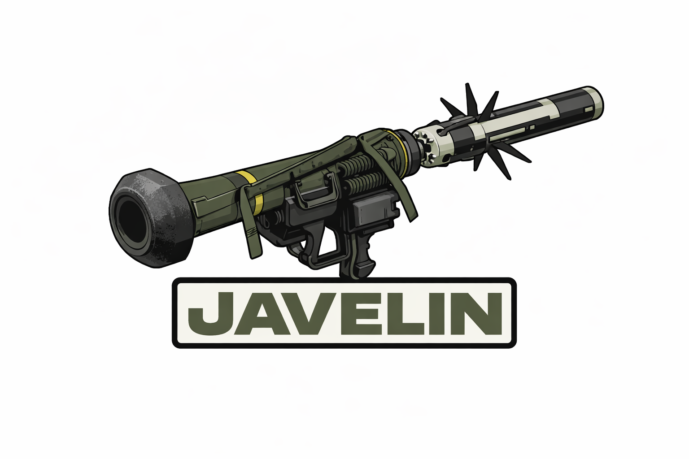

# Javelin

<div align="center">




A Nintendo Switch homebrew toolkit for MTP file transfer, NSP/XCI installation, game dumping, and ticket management.

[Features](#features) • [Installation](#installation) • [Usage](#usage) • [Localization](#localization) • [Building](#building) • [Contributing](#contributing)

</div>

## Known Issues
- Closing the application with '+' button while mtp is running may cause the switch to black screen and require a hard reset.
- Album storage is currently non-working / placeholder only.
- XCI installation hasn't been fully tested.
- License type currently only shows unknown on ticket explorer
## Features

- **MTP File Transfer** - Full Media Transfer Protocol (PIMA 15740) implementation for seamless file transfers between Switch and PC via USB
- **NSP/XCI Installation** - Install titles directly from PC over MTP with real-time progress tracking, supporting both SD card and NAND targets
- **Game Dumping** - Dump installed games as merged or separate NSPs, and dump gamecards as XCI or NSP
- **Ticket Browser** - Browse installed common and personalized tickets, view detailed ticket data including decrypted titlekeys (with prod.keys), and delete individual tickets
- **Save File Management** - Access and manage game saves over MTP
- **Gamecard Support** - Virtual XCI/NSP streaming from gamecard secure partition over MTP
- **Virtual File System** - Exposes SD card, NAND partitions, save data, album, and more as MTP storage devices
- **Multi-language Support** - 27+ languages with Crowdin integration for community translations
- **Modern GUI** - ImGui-based interface with gamepad navigation, touchscreen support, virtual mouse cursor, toast notifications, and modal progress dialogs

## Installation

### Prerequisites

- A Nintendo Switch running custom firmware (Atmosphere recommended)
- A homebrew menu (e.g. [nx-hbmenu](https://github.com/switchbrew/nx-hbmenu))

### Installing

1. Download the latest `Javelin.nro` from the [Releases](https://github.com/1312Delta/Javelin/releases) page
2. Place `Javelin.nro` in `/switch/Javelin/` on your SD card
3. Launch Javelin from your homebrew menu

### Optional

- Place `prod.keys` at `/switch/prod.keys` on your SD card to enable titlekey decryption in the Ticket Browser and key data for gamecard dumps

## Usage

### MTP File Transfer

1. Open Javelin and select **MTP File Transfer**
2. Press **Start MTP**
3. Connect your Switch to PC via USB cable
4. Your Switch will appear as a portable device on your computer

**Available MTP Storage:**

| Storage | Description |
|---------|-------------|
| SD Card | Full SD card read/write access |
| NAND User | User partition storage |
| NAND System | System partition storage |
| Install (SD) | Drop NSP/XCI files here to install to SD |
| Install (NAND) | Drop NSP/XCI files here to install to NAND |
| Save Data | Game save files |
| Album | Screenshots and video captures |
| Gamecard | Virtual XCI/NSP from inserted gamecard |

### Game Dumping

1. Select **Dump Games** from the main menu
2. Choose the **Installed** tab or **Gamecard** tab
3. Select a game and pick a dump mode:
   - **Installed games**: Dump Merged NSP (single file) or Dump Separate NSPs (one per content)
   - **Gamecard**: Dump as XCI or Dump as NSP
4. Dumps are saved to `/switch/Javelin/backups/` on your SD card

### Ticket Browser

1. Select **Ticket Browser** from the main menu
2. Tickets auto-load on first visit
3. Use filter tabs to view All, Common, or Personalized tickets
4. Press A on any ticket to view its full details:
   - Rights ID, Issuer, Encrypted/Decrypted Titlekey
   - License type, Key generation, Property flags
   - Ticket ID, Device ID, Account ID
5. Delete individual tickets from the detail view

### Controls

| Input | Action |
|-------|--------|
| D-pad / Right stick | Navigate UI |
| Left stick | Virtual mouse cursor |
| A / ZR | Select / Left click |
| B | Back / Right click (mouse mode) |
| + | Exit application |
| Touchscreen | Direct touch input |

## Localization

Javelin supports 27+ languages through a JSON-based translation system managed via [Crowdin](https://crowdin.com/).

### Supported Languages
#### Currently available languages include:
English,Spanish
#### Currently missing translations for:
Afrikaans, Arabic, Catalan, Czech, Danish, Dutch, Finnish, French, German, Greek, Hebrew, Hungarian, Italian, Japanese, Korean, Norwegian, Polish, Portuguese, Romanian, Russian, Serbian, Swedish, Turkish, Ukrainian, Vietnamese

### Contributing Translations

Visit our [Crowdin project](https://crowdin.com/project/javelin) to contribute translations. See [LOCALIZATION.md](LOCALIZATION.md) for details on manual translation.

## Building

### Prerequisites

- [devkitPro](https://devkitpro.org/) with Switch support (`switch-dev` package group)
- `DEVKITPRO` environment variable set (typically `/opt/devkitpro`)

### Compilation

```bash
# Clone with submodules
git clone --recurse-submodules https://github.com/1312Delta/Javelin.git
cd Javelin

# Build
make gen_translations  # Generate embedded translation data
make -j$(nproc)

# Output: Javelin.nro
```
### CI

Builds run automatically via GitHub Actions using devkitPro's container toolchain on every push and pull request.

## Project Structure

```
Javelin/
├── source/
│   ├── main.cpp             # Entry point, EGL/ImGui init, render loop
│   ├── core/                # Event system & GUI manager
│   ├── mtp/                 # MTP protocol, storage, install, saves, gamecard, dump
│   ├── install/             # NSP/XCI parsing, NCA installation, CNMT, FAT32
│   ├── dump/                # Game & gamecard dump logic
│   ├── tickets/             # Ticket browser & detail viewer
│   ├── ui/                  # ImGui Switch platform/renderer backend
│   └── i18n/                # Localization system & embedded translations
├── include/                 # Headers (mirrors source/ structure)
├── libs/
│   ├── imgui/               # Dear ImGui (submodule)
│   ├── EventBus/            # Event dispatch (submodule)
│   └── libnx-ext/           # Extended libnx IPC wrappers (ES, etc.)
├── romfs/javelin/i18n/      # Translation JSON files
├── tools/                   # Build-time code generators
├── app.json                 # Switch application metadata & service access
├── Makefile
└── crowdin.yml              # Crowdin localization config
```

## Architecture

### Threading Model

- **Main thread** - EGL/OpenGL rendering, ImGui frame loop, input handling, event dispatch (~60 FPS)
- **MTP thread** - Launched on-demand, runs `mtpProtocolProcess()` in a tight loop with 1ms sleep, handles all USB/MTP communication

Synchronization uses `std::mutex` (EventBus) and libnx `Mutex` (storage object cache). Transfer cancellation is tracked via per-transfer global map.

### Event System

Thread-safe singleton EventBus with priority-based listeners and cancellation support. Event types include screen navigation, notifications, transfer progress, and installation progress.

### MTP Storage IDs

| ID | Storage |
|----|---------|
| `0x00010001` | SD Card |
| `0x00010002` | NAND User |
| `0x00010003` | NAND System |
| `0x00010005` | Install (SD) |
| `0x00010006` | Install (NAND) |
| `0x00010007` | Save Data |
| `0x00010008` | Album |
| `0x00010009` | Gamecard |

## Dependencies

| Library                                             | License | Purpose |
|-----------------------------------------------------|---------|---------|
| [libnx](https://github.com/switchbrew/libnx)        | ISC | Switch system services & crypto |
| [Dear ImGui](https://github.com/ocornut/imgui)      | MIT | Immediate mode GUI |
| [EventBus](https://github.com/gelldur/EventBus)     | Apache 2.0 | Thread-safe event dispatch |
| [Libnx-ext](https://github.com/XorTroll/libnx-ext/) | MIT | Extended libnx IPC wrappers (ES, etc.) |

## Contributing

Contributions are welcome! Please read [CONTRIBUTING.md](CONTRIBUTING.md) for guidelines.

## License

This project (the code written by the project authors) is licensed under the MIT License — see `LICENSE` in the project root for details.

Third-party libraries bundled with this project retain their own licenses (see `THIRD_PARTY_NOTICE.md` and the `libs/` subdirectories for details). Notably, the project includes components under MIT and Apache-2.0 licenses.

## Acknowledgments

- [switchbrew](https://switchbrew.org/) - Switch reverse engineering documentation
- [libnx](https://github.com/switchbrew/libnx) - Switch homebrew development library
- [Dear ImGui](https://github.com/ocornut/imgui) - Immediate mode GUI library
- [devkitPro](https://devkitpro.org/) - Homebrew toolchain
- [XorTroll](https://github.com/XorTroll/) - Libnx-ext development

## Disclaimer

This software is provided as-is for educational and personal use. The authors are not responsible for any damage to your device or software. Always back up your data before using homebrew applications. This tool does not condone piracy.
